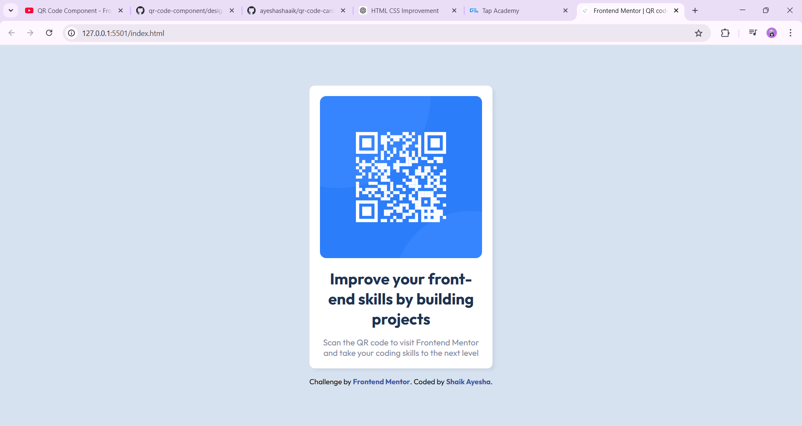
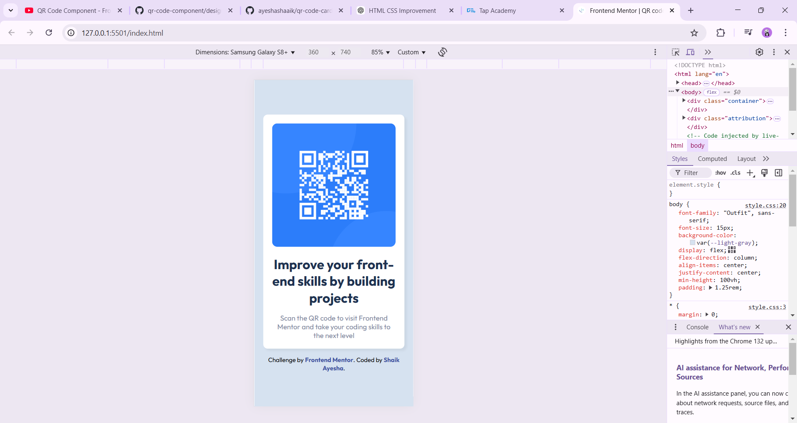

# Frontend Mentor - QR code component

This is a responsive QR Code component built using HTML and CSS as part of a Frontend Mentor challenge.

## 📸 Desktop View

## 📱 Mobile View

## The challenge

This is a simple and responsive QR Code component built using HTML and CSS as part of the Frontend Mentor challenge. The goal was to replicate the design as accurately as possible while maintaining clean and structured code.

Through this project, I practiced essential front-end skills, focusing on layout, responsiveness, and pixel-perfect design implementation. It was a great opportunity to enhance my CSS styling techniques and improve my ability to build well-structured components
